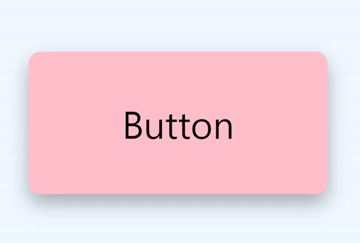

# Button-Ripple-Effect


## 효과   
버튼에 마우스를 오버하면 물결처럼 색이 변하는 효과   

## 학습   
### 1. JS : setProperty() 메서드   
인터페이스는 CSS 스타일 선언 객체의 속성에 대한 새 값을 설정    
```
setProperty(propertyName, value)  
setProperty(propertyName, value, priority)
```
- **propertyName**  
수정할 CSS 속성 이름(하이픈 표기)을 나타내는 문자열

- **value**   
새 속성 값이 포함된 문자열입니다. 지정하지 않으면 빈 문자열로 처리    

- **priority**   
"중요한" CSS 우선순위를 설정할 수 있는 문자열입니다. 지정하지 않으면 빈 문자열로 처리  

    ```
    var declaration = document.styleSheets[0].cssRules[0].style;
    var setprop = declaration.setProperty("background-color", "yellow", "important");
    ```

### 2. MouseEvent: pageX, pageY 속성  
마우스 이벤트가 발생할 때 마우스 포인터의 문서(웹페이지) 상대 X, Y 좌표를 pageX, pageY에 반환(마우스 포인터의 위치 파악 가능)

예 ) 마우스 버튼을 클릭할 때 마우스 포인터의 좌표를 가져옵니다.
```
let x = event.pageX;  // Horizontal
let y = event.pageY;  // Vertical
```

### 3. HTMLElement: offsetLeft, offsetTop 속성    
이벤트 객체를 기준으로 현재 마우스 포인터의 위치를 반환 

예) "myDIV"의 위치를 가져옵니다.
```
const element = document.getElementById("myDIV");
let pos1= element.offsetTop;
let pos2= element.offsetLeft;
```

## 학습 출처 
- 유튜브   
https://www.youtube.com/@JavaScriptKing     

- JS  
https://developer.mozilla.org/en-US/docs/Web/API/CSSStyleDeclaration/setProperty    
https://www.w3schools.com/jsref/met_cssstyle_setproperty.asp    
https://www.w3schools.com/jsref/event_pagex.asp    


- 키워드   
setProperty()     
MouseEvent: pageX, pageY   
HTMLElement: offsetLeft, offsetTop   